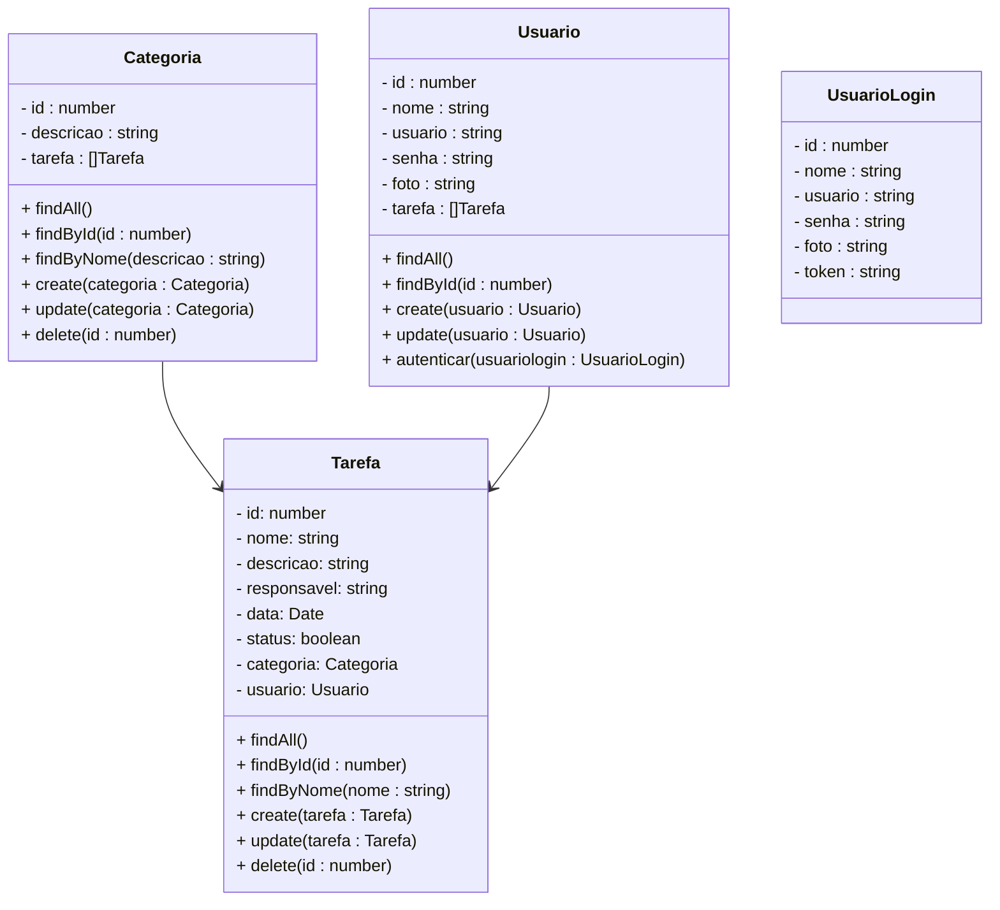

# 🚧Projeto Todo List - Backend

 

    

  

## 1. Descrição

O aplicativo **Todo Lis**t é uma ferramenta intuitiva que permite aos usuários gerenciar suas tarefas diárias de forma eficiente. Com uma interface simples e moderna, os usuários podem adicionar, editar, marcar como concluídas e remover tarefas, ajudando a manter o foco e a produtividade.

## Funcionalidades

- **Adicionar Tarefas**: Os usuários podem adicionar novas tarefas com um título e descrição opcional.
- **Marcar como Concluída**: As tarefas podem ser facilmente marcadas como concluídas, permitindo que os usuários vejam o que já foi realizado.
- **Editar Tarefas**: Os usuários têm a opção de editar as tarefas existentes para atualizá-las conforme necessário.
- **Remover Tarefas**: Tarefas que não são mais necessárias podem ser removidas da lista com um simples toque.
- **Filtragem de Tarefas**: O aplicativo permite filtrar tarefas por status (concluídas e pendentes) para facilitar a visualização.
- **Persistência de Dados**: As tarefas são armazenadas localmente, garantindo que não sejam perdidas mesmo após o fechamento do aplicativo.
- **Notificações**: Os usuários podem definir lembretes para tarefas específicas, recebendo notificações quando for a hora de realizá-las.
- **Temas Personalizáveis**: Os usuários podem escolher entre diferentes temas (claro, escuro) para personalizar a aparência do aplicativo.

------

## 2. Sobre esta API

Neste projeto, será desenvolvido um **Mínimo Produto Viável (MVP)** de um aplicativo **Todo List**, implementando os CRUDs (Create, Read, Update, Delete) para os principais registros de um sistema de tarefas. Esses registros são essenciais para permitir que o usuário gerencie de forma eficiente suas no dia a dia. A solução abrangerá as três entidades mais comuns em um sistema Todo List:

1. **Usuários**: Representam os usuários do aplicativo.  
2. **Categorias**: Representam as categorias em que as terefas serão classificadas.  

3. **Tarefas**: Representam as tarefas do dia a dia.  

### 2.1. Principais Funcionalidades

1. Cadastro e gerenciamento de usuários (em desenvolvimento)
2. Registro e gerenciamento das categorias
3. Criação e gerenciamento das tarefas

------

## 3. Diagrama de Classes

**Observações Importantes:**

- O Recurso Usuario ainda não foi implementado

------

## 4. Diagrama Entidade-Relacionamento (DER)

------

## 5. Tecnologias utilizadas

| Item                          | Descrição  |
| ----------------------------- | ---------- |
| **Servidor**                  | Node JS    |
| **Linguagem de programação**  | TypeScript |
| **Framework**                 | Nest JS    |
| **ORM**                       | TypeORM    |
| **Banco de dados Relacional** | MySQL      |

------

## 6. Configuração e Execução

1. Clone o repositório
2. Instale as dependências: `npm install`
3. Configure o banco de dados no arquivo `app.module.ts`
4. Execute a aplicação: `npm run start:dev`
